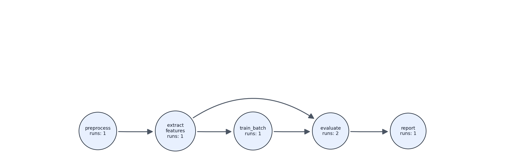
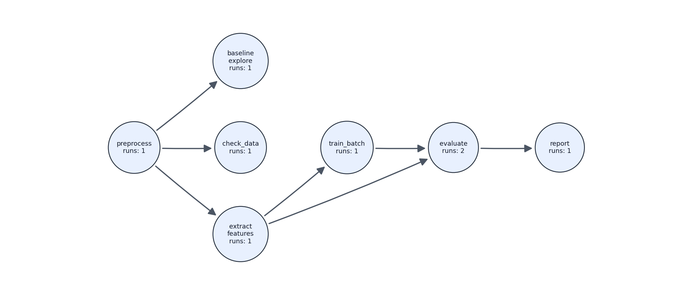

# Demo: Climate Analysis Pipeline

This walkthrough demonstrates every major Tracey capability in a single coherent experiment. A researcher is building a pipeline to detect temperature anomalies in a 25-day climate record from station STN001.

The story: the researcher first tries a crude threshold-based approach (abandoned mid-experiment), then adopts feature extraction and a linear-trend model, submitting training to a Slurm cluster. The model is evaluated twice, first with RMSE only, then after adding MAE, before a final report is generated.

None of the pipeline scripts are modified for Tracey. It captures everything in the background.

## Table of contents

1. [Visual reference](#visual-reference)
2. [Pipeline overview](#pipeline-overview)
3. [Scripts in this example](#scripts-in-this-example)
4. [Walkthrough](#walkthrough)
5. [Features demonstrated](#features-demonstrated)

## Visual reference

**Main pipeline**: this was derived by tracey from captured runs (excludes the abandoned baseline branch):



**Full experiment**: this was also derived by tracey from all captured nodes, including the abandoned `baseline_explore` branch:




## Pipeline overview

```
data/raw_climate.csv
        |
  [preprocess]  ─────────────────────> data/cleaned.csv
        |                                      |
        |                          [extract_features]
        |                                      |
        └──> [baseline_explore] (icap)    data/features.csv
                     |                         |
             results/baseline_stats.txt   [train_batch] (sbatch)
                  (abandoned)                   |
                                  models/model.txt + results/train_log.txt
                                                |
                                          [evaluate]  <- run 1 (RMSE only)
                                          [evaluate]  <- run 2 (RMSE + MAE, after edit)
                                                |
                                        results/metrics.json
                                                |
                                           [report]  <- final node
                                                |
                                      results/final_report.txt
```


## Scripts in this example

| Script | Node name | Capture mode | Input | Output |
|--------|-----------|---------|-------|--------|
| `preprocess.py` | `preprocess` | autocap | `data/raw_climate.csv` | `data/cleaned.csv` |
| `extract_features.py` | `extract_features` | autocap | `data/cleaned.csv` | `data/features.csv` |
| `utils/check_data.py` | `check_data` (dynamic) | autocap `--discover python` | `data/cleaned.csv` | *(stdout only)* |
| `baseline_explore.py` | `baseline_explore` | **icap** | `data/cleaned.csv` | `results/baseline_stats.txt` |
| `batch/train_job.sbatch` / `train.py` on compute | `train_batch` | autocap via **sbatch** | `data/features.csv`, `train.py` | `models/model.txt`, `results/train_log.txt` |
| `evaluate.py` | `evaluate` | autocap | `data/features.csv`, `models/model.txt` | `results/metrics.json` |
| `report.py` | `report` | autocap | `results/metrics.json` | `results/final_report.txt` |

---

## Walkthrough

> Tracey must be installed to run this demo. See [Get Access](../../README.md#get-access).

### Phase 1: Initialize the experiment

```bash
tracey init -d "Climate variability analysis"
```

```
Initialized Tracey experiment: climate_pipeline
  Root      : /your/experiment/path
  Metadata  : /your/experiment/path/.tracey
  Nodes dir : /your/experiment/path/.tracey/nodes
  Pack file : /your/experiment/path/.tracey/pack.yaml
```

```bash
ls .tracey/
# logs  nodes  pack.yaml  replays  store  tracey.yaml
```

---

### Phase 2: Register the preprocess rule

```bash
tracey autocap add preprocess.py
# Note: inferred outputs for preprocess: data/cleaned.csv
# Added 1 capture rule(s).

tracey autocap list
# Node                 Match          Script
# ----------------------------------------------------------------------
# preprocess           command        preprocess.py
```

---

### Phase 3: Install hooks and start capture

One-time shell hook installation, then start the daemon:

```bash
tracey autocap hook install --shell all
tracey autocap start
tracey autocap doctor
```

```
Session: running (pid ...)
Hooks:
  - bash: installed (~/.bashrc)
  - zsh: installed (~/.zshrc)
Backends:
  - process_polling: active
  - file_diff_fallback: active
  - hook_events: active
Health: ok
```

---

### Phase 4: Run preprocess

```bash
python preprocess.py
# preprocess: 23 records written to data/cleaned.csv (2 skipped)
```

```bash
tracey node list
# Node               Run  Time                     Mode         Command
# preprocess           1  ...                      auto         python preprocess.py
```

```bash
tracey node list --long
# preprocess run 1
#   inputs : data/raw_climate.csv
#   outputs: data/cleaned.csv
#   snaps  : 1 script(s), 1 input(s), 1 output(s)
```

---

### Phase 5: Exploratory baseline via interactive capture (icap)

The researcher tries a simple threshold approach in an icap session. The approach is ultimately abandoned, but its provenance is preserved.

```bash
tracey icap baseline_explore
```

Inside the session:

```
python baseline_explore.py
# baseline_explore: 6 days above 3.0C, 3 below -3.0C (written to results/baseline_stats.txt)
exit   (or Ctrl-])
# Saved node run: .tracey/nodes/baseline_explore_run_1.yaml
```

```bash
tracey node note baseline_explore 1 "abandoning this path"

tracey node list
# Node               Run  Mode         Note
# baseline_explore     1  interactive  abandoning this path
# preprocess           1  auto         -
```

---

### Phase 6: Add discovery rule for the rest of the pipeline

Rather than registering a rule for each remaining script, a single `--discover python` rule covers everything run from the project directory:

```bash
tracey autocap add . --discover python --recursive

tracey autocap list
# Node                 Match          Script
# ----------------------------------------------------------------------
# preprocess           command        preprocess.py
# discover_python      dynamic:python .
```

---

### Phase 7: Run feature extraction

`utils/check_data.py` was never explicitly registered, the discovery rule from Phase 6 captures it automatically when it is launched.

```bash
python utils/check_data.py
# check_data: 23 records in data/cleaned.csv
#   temp_c range : -5.2 C to 6.3 C   |   mean: 0.67 C   |   OK

python extract_features.py
# extract_features: 23 records written to data/features.csv (4 anomalies flagged)
```

```bash
tracey node list
# Node               Run  Mode
# extract_features     1  auto
# check_data           1  auto         <-- auto-discovered, never pre-registered
# baseline_explore     1  interactive
# preprocess           1  auto
```

---

### Phase 8: Training via Slurm (`sbatch`)

The training job is submitted normally. Tracey captures the compute-node execution via `BASH_ENV` hooks and trace logs on the shared filesystem.

```bash
tracey autocap add batch/train_job.sbatch --node train_batch

sbatch batch/train_job.sbatch
squeue -u "${USER}"   # wait for job to finish
```

```bash
tracey node show train_batch 1
# Node: train_batch
# commands:
#   - batch/train_job.sbatch
# inputs:
#   - train.py
#   - data/features.csv
# outputs:
#   - models/model.txt
#   - results/train_log.txt
```

---

### Phase 9: First evaluation (RMSE only)

```bash
python evaluate.py
# evaluate: n=23, rmse=3.0770  -> results/metrics.json

tracey node note evaluate 1 "initial evaluation: RMSE only, MAE not yet computed"
```

---

### Phase 10: Update the evaluation script and re-run

The script is edited to add MAE. Tracey records the second run as a new numbered entry, the first run's snapshot is preserved intact.

```bash
python evaluate.py
# evaluate: n=23, rmse=3.0770, mae=2.5732  -> results/metrics.json

tracey node note evaluate 2 "updated evaluation: added MAE metric"

tracey node list
# Node               Run  Note
# evaluate             2  updated evaluation: added MAE metric
# evaluate             1  initial evaluation: RMSE only, MAE not yet computed
# train_batch          1  -
# extract_features     1  -
# check_data           1  -
# baseline_explore     1  abandoning this path
# preprocess           1  -
```

---

### Phase 11: Final step and stop

```bash
python report.py
# report: wrote results/final_report.txt

tracey node set-final report
tracey autocap stop --all
```

---

### Phase 12: Inspect runs

```bash
tracey node show evaluate 1
# Node: evaluate  |  Run: 1
# Note   : initial evaluation: RMSE only, MAE not yet computed
# inputs : data/features.csv, models/model.txt
# outputs: results/metrics.json
# snaps  : 1 script, 2 inputs, 1 output

tracey node show evaluate 2
# Node: evaluate  |  Run: 2
# Note   : updated evaluation: added MAE metric
# inputs : data/features.csv, models/model.txt
# outputs: results/metrics.json
# snaps  : 1 script, 2 inputs, 1 output
```

---

### Phase 13: Replay run 1 (post-script-change)

Replay of run 1 re-executes the original RMSE-only version of `evaluate.py`, even though the script has since been edited to add MAE.

```bash
tracey replay evaluate 1 --dry-run
# Replay dir : .tracey/replays/evaluate_run_1
# Command    : python evaluate.py
# Scripts    : 1  |  Inputs: 2

tracey replay evaluate 1
# evaluate: n=23, rmse=3.0770  -> results/metrics.json
# Replay finished with exit code 0

cat .tracey/replays/evaluate_run_1/results/metrics.json
# { "n_samples": 23, "rmse": 3.077 }   <-- no mae field; original script restored
```

---

### Phase 14: Workflow derivation

```bash
# Full DAG including all captured nodes
tracey workflow --to report

# Shortest subgraph: main pipeline only (excludes abandoned baseline branch)
tracey workflow --from preprocess --to report --path-mode shortest \
  --output .tracey/workflow_main.yaml

# Pin evaluate run 2 (RMSE + MAE) for packaging
tracey workflow \
  --from preprocess --to report \
  --path-mode shortest \
  --select evaluate=2 \
  --output .tracey/workflow_eval2.yaml
```

---

### Phase 15: DAG visualization

```bash
# Full experiment graph (all nodes, including abandoned baseline)
tracey graph --source nodes --output figures/full_experiment.png

# Main pipeline graph (from derived workflow)
mkdir -p figures
tracey graph \
  --source workflow \
  --workflow-file .tracey/workflow_eval2.yaml \
  --output figures/main_pipeline.png
```

---

### Phase 16: Packaging

```bash
tracey pack --config .tracey/workflow_eval2.yaml
# INFO:    Build complete: tracey.sif
# preprocess: 23 records written to data/cleaned.csv
# extract_features: 23 records written to data/features.csv
# evaluate: n=23, rmse=3.0770, mae=2.5732  -> results/metrics.json
# report: wrote results/final_report.txt
# Output files are in: /tmp/tmp.xxxxx
```

The container runs the full pipeline from scratch on any machine. Slurm commands (`sbatch`, `module load`) are automatically translated or dropped for container portability.

---

## Features demonstrated

| Feature | Phase |
|---------|-------|
| `tracey init` | 1 |
| `tracey autocap add`: explicit rule | 2 |
| Shell hook install, daemon start, `doctor` | 3 |
| Autocap background capture | 4 |
| `tracey icap`: exploratory session, abandoned path | 5 |
| `tracey autocap add --discover python`: dynamic rule | 6 |
| Auto-capture of an unregistered script | 7 |
| Slurm `sbatch` integration, compute-node capture | 8 |
| Multiple runs of the same node | 9, 10 |
| Script modification between runs | 10 |
| `tracey node list / show / note` | 12 |
| `tracey replay` with snapshot restore, post-edit | 13 |
| Subgraph workflow derivation, `--select` run pinning | 14 |
| `tracey graph --source nodes` (full experiment) | 15 |
| `tracey graph --source workflow` (clean pipeline) | 15 |
| `tracey pack` with Slurm command translation | 16 |
